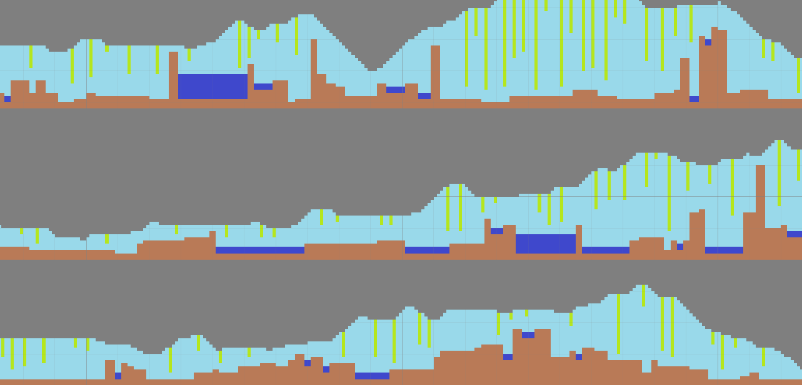
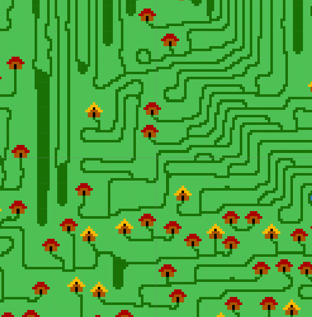

# Wave Function Collapse

Fell in love with the Wave Function Collapse algorithm as described [here](https://github.com/mxgmn/WaveFunctionCollapse) to create procedural content (mainly textures and maps).

This is basically a Markov-chain to solve constraint problems, but it's very effective.

So, what this does is that from a template like:

 

it can generate a into a larger image that preserves the features of the original:

 

Most of the code was heavily inspired by the original version, but it was created from scratch (which explains why it's much slower).

It was created within Unity so I could test it using the editor. Just select the Generator object and select options and press the buttons to either step by step or generate the whole map at once.

Although this works, I still have a lot of fail cases (which the original also has) and bugs (for example, on the image above, where are the lakes I was expecting? Can we get rid of those thick green areas? Can we have more grass?)

I still want to investigate this a bit more, and perhaps create a generalized solver for some ideas I have.

## License

All source code used is licensed under the [MIT license](LICENSE).
The art assets were taken from the original site.

## Metadata

* Autor: [Diogo Andrade]

[Diogo Andrade]:https://github.com/DiogoDeAndrade
